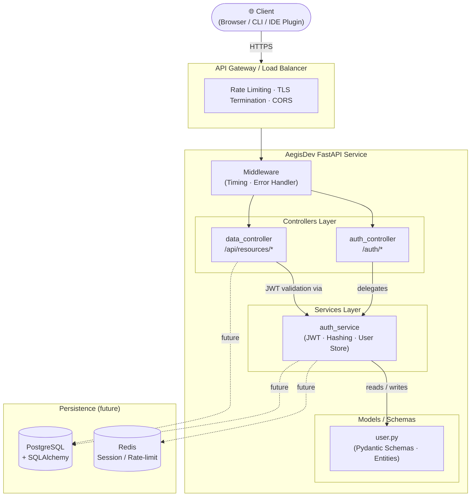
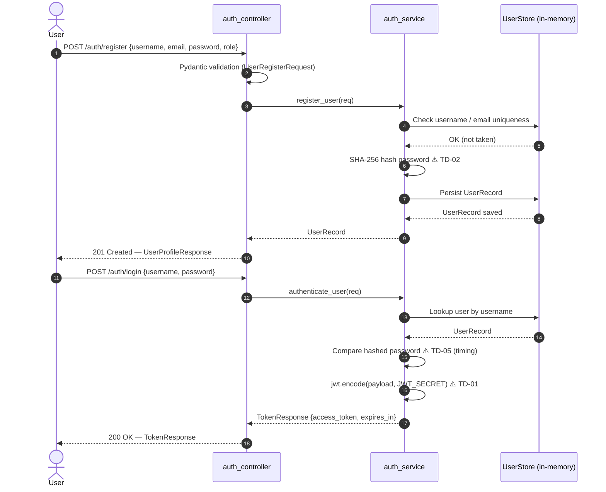
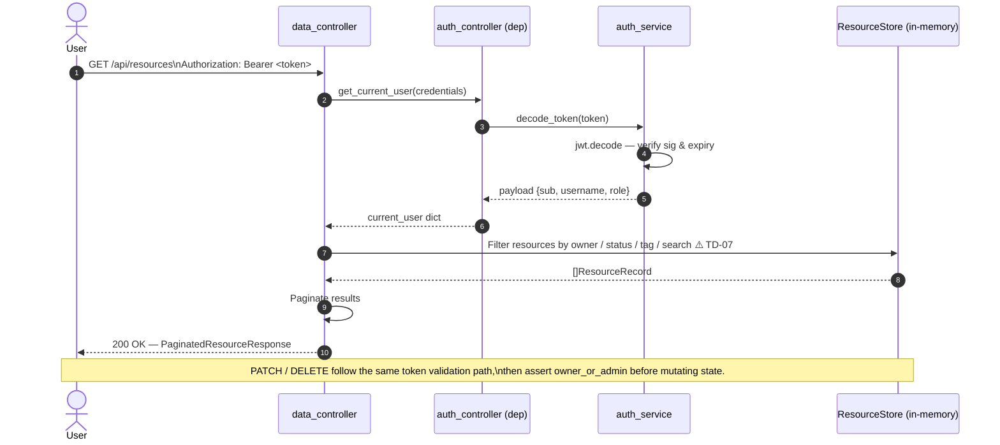

# AegisDev — Developer Onboarding Guide

> **Version:** 2.0 · **Last updated:** 2025 (post-AegisDev Security Audit)
> Welcome to AegisDev — the Autonomous Developer Workflow Engine & Code Review Coach.  
> This document is your single source of truth for understanding the system and getting a local environment running from scratch.

---

## Table of Contents

1. [System Overview](#1-system-overview)
2. [Component Responsibilities](#2-component-responsibilities)
3. [Architecture Flowchart](#3-architecture-flowchart)
4. [Authentication & Data Access — Sequence Diagram](#4-authentication--data-access--sequence-diagram)
5. [Local Environment Setup](#5-local-environment-setup)
6. [Environment Variables Reference](#6-environment-variables-reference)
7. [Running Tests](#7-running-tests)
8. [Known Technical Debt](#8-known-technical-debt)

---

## 1. System Overview

AegisDev is a Python **FastAPI** microservice that exposes two primary domain surfaces:

| Surface | Prefix | Purpose |
|---|---|---|
| **Authentication** | `/auth` | User registration, login (JWT issuance), profile retrieval |
| **Data / Resources** | `/api` | CRUD for project resources with role-based access and query filtering |

The service is designed to be stateless at the request level — all identity information is carried in the signed JWT — while resource state is currently maintained in an in-memory store (to be replaced by a persistent database in a production deployment).

---

## 2. Component Responsibilities

```
src/
├── main.py                     ← App bootstrap, CORS, middleware, router registration
├── controllers/
│   ├── auth_controller.py      ← HTTP layer for /auth/* — validates input, delegates to service
│   └── data_controller.py      ← HTTP layer for /api/resources/* — filtering, pagination, authz
├── services/
│   └── auth_service.py         ← Business logic: hashing, JWT signing/decoding, user store
└── models/
    └── user.py                 ← Pydantic schemas (request/response) + in-memory ORM entities
```

### Responsibility Matrix

| Layer | Owns | Must NOT |
|---|---|---|
| **Controller** | HTTP request/response contract, input coercion, HTTP status codes | Contain business logic or touch the data store directly |
| **Service** | Business rules, security operations (hashing, token generation), data persistence | Know about HTTP concepts (status codes, request objects) |
| **Model** | Schema validation, serialisation, entity shape | Contain business logic or service calls |
| **main.py** | App lifecycle, middleware chain, router mounting | Contain endpoint logic |

---

## 3. Architecture Flowchart



---

## 4. Authentication & Data Access — Sequence Diagram

### 4.1 User Registration & Login



### 4.2 Authenticated Resource Access



---

## 5. Local Environment Setup

### Prerequisites

| Tool | Minimum Version | Install |
|---|---|---|
| Python | 3.11 | [python.org](https://python.org) |
| pip | 23.x | bundled with Python |
| Git | 2.x | [git-scm.com](https://git-scm.com) |

> **Optional:** [Docker](https://docs.docker.com/get-docker/) for containerised runs.

---

### Step 1 — Clone the Repository

```bash
git clone https://github.com/your-org/aegisdev.git
cd aegisdev
```

---

### Step 2 — Create & Activate a Virtual Environment

**macOS / Linux**
```bash
python3 -m venv .venv
source .venv/bin/activate
```

**Windows (PowerShell)**
```powershell
python -m venv .venv
.\.venv\Scripts\Activate.ps1
```

---

### Step 3 — Install Dependencies

```bash
pip install -r requirements.txt
```

---

### Step 4 — Configure Environment Variables

Copy the example env file and fill in your values:

```bash
cp .env.example .env
```

Edit `.env`:

```dotenv
# REQUIRED — no fallback; generate with:
#   python -c "import secrets; print(secrets.token_hex(32))"
JWT_SECRET=<your-secret-here>

# Optional overrides
APP_ENV=development
ACCESS_TOKEN_TTL=3600

# Comma-separated allowed CORS origins (default: localhost:3000)
ALLOWED_ORIGINS=http://localhost:3000
```

> ⚠️ **Never commit `.env` to version control.** It is listed in `.gitignore`.

---

### Step 5 — Run the Development Server

```bash
uvicorn src.main:app --reload --port 8000
```

The API is now available at:

| URL | Purpose |
|---|---|
| `http://localhost:8000/docs` | Swagger UI (interactive) |
| `http://localhost:8000/redoc` | ReDoc API documentation |
| `http://localhost:8000/health` | Health check endpoint |

---

### Step 6 — Smoke Test (cURL)

```bash
# Register a user
curl -s -X POST http://localhost:8000/auth/register \
  -H "Content-Type: application/json" \
  -d '{"username":"alice","email":"alice@example.com","password":"S3cur3Pass!","role":"developer"}' \
  | python -m json.tool

# Login
TOKEN=$(curl -s -X POST http://localhost:8000/auth/login \
  -H "Content-Type: application/json" \
  -d '{"username":"alice","password":"S3cur3Pass!"}' | python -c "import sys,json; print(json.load(sys.stdin)['access_token'])")

# Create a resource
curl -s -X POST http://localhost:8000/api/resources \
  -H "Authorization: Bearer $TOKEN" \
  -H "Content-Type: application/json" \
  -d '{"name":"Sprint-42 Review","description":"Code review for sprint 42","tags":["backend","security"]}' \
  | python -m json.tool

# List resources
curl -s http://localhost:8000/api/resources \
  -H "Authorization: Bearer $TOKEN" | python -m json.tool
```

---

### Step 7 — (Optional) Run with Docker

```dockerfile
# Dockerfile provided at repo root
docker build -t aegisdev:latest .
docker run -p 8000:8000 --env-file .env aegisdev:latest
```

---

## 6. Environment Variables Reference

| Variable | Default | Required | Description |
|---|---|---|---|
| `JWT_SECRET` | _(none — startup fails if absent)_ | **YES** | JWT signing secret. Generate: `python -c "import secrets; print(secrets.token_hex(32))"` |
| `ALLOWED_ORIGINS` | `http://localhost:3000` | No | Comma-separated list of allowed CORS origins. |
| `APP_ENV` | `development` | No | Environment label (`development`, `staging`, `production`). |
| `ACCESS_TOKEN_TTL` | `3600` | No | JWT access-token lifetime in seconds. |

---

## 7. Running Tests

```bash
# Install test dependencies
pip install pytest pytest-asyncio httpx

# Run all tests
pytest tests/ -v

# Run with coverage
pytest tests/ --cov=src --cov-report=term-missing
```

Test files live under `tests/` and mirror the `src/` layout:

```
tests/
├── test_auth_controller.py
├── test_data_controller.py
├── test_auth_service.py
└── conftest.py
```

---

## 8. Audit & Remediation Summary (Task 2)

AegisDev's Autonomous Security Auditor completed a full OWASP ASVS 4.0 scan.
**All 10 identified items have been autonomously remediated.**

| ID | Location | Issue | Severity | Resolution |
|---|---|---|---|---|
| TD-01 | `auth_service.py` | Hardcoded JWT secret fallback | 🔴 Critical | ✅ `EnvironmentError` raised at startup if `JWT_SECRET` absent |
| TD-02 | `auth_service.py` | SHA-256 password hashing | 🔴 Critical | ✅ PBKDF2-HMAC-SHA256, 600k iterations, 32-byte salt |
| TD-03 | `auth_service.py` | No token revocation | 🟠 High | ✅ JTI claim + revocation set + `/auth/logout` endpoint |
| TD-04 | `auth_service.py` | Non-thread-safe user store | 🟠 High | ✅ `threading.Lock` on all compound operations |
| TD-05 | `auth_service.py` | Timing-attack password compare | 🟠 High | ✅ `secrets.compare_digest`, constant-time path |
| TD-06 | `data_controller.py` | Non-thread-safe resource store | 🟠 High | ✅ `threading.Lock` on all compound operations |
| TD-07 | `data_controller.py` | Unsanitised search/tag/owner params | 🟡 Medium | ✅ Allow-list regexes + UUID validation + length caps |
| TD-08 | `main.py` | CORS wildcard `allow_origins=["*"]` | 🟡 Medium | ✅ Explicit origin list from `ALLOWED_ORIGINS` env var |
| TD-09 | `main.py` | Raw exception disclosure | 🟡 Medium | ✅ Generic message + UUID error-ref ID; detail logged only |
| TD-10 | `models/user.py` | No password complexity policy | 🔵 Low | ✅ Validator enforces uppercase, digit, special char |

**Audit reports:**
- Machine-readable SARIF: [`reports/security-audit.sarif`](../reports/security-audit.sarif)
- Human-readable report: [`reports/SECURITY_AUDIT_REPORT.md`](../reports/SECURITY_AUDIT_REPORT.md)
